<!-- Hero generated by GitHub Profile Agent Console. To regenerate: edit profile.config.json, then run `npm run generate`. -->

  <picture>
    <source media="(max-width: 760px) and (prefers-color-scheme: dark)" srcset="./assets/hero/agent-console-609a22c3-mobile-dark.svg">
    <source media="(max-width: 760px)" srcset="./assets/hero/agent-console-609a22c3-mobile-light.svg">
    <source media="(prefers-color-scheme: dark)" srcset="./assets/hero/agent-console-609a22c3-dark.svg">
    <source media="(prefers-color-scheme: light)" srcset="./assets/hero/agent-console-609a22c3-light.svg">
    
  </picture>

I build practical Laravel and Flutter systems for real organizations — from POS platforms to data-center asset management — and I'm currently finishing a thesis on a hybrid LSTM-XGBoost stock prediction system.

---

### 🧭 Currently

- 🎓 Finishing my final thesis (**MARIMO**) — a seed stock prediction & priority system using a hybrid LSTM-XGBoost model
- 💼 Developing **SIM TIK** during my internship at Kominfo Situbondo
- 🎨 Improving my UI/UX and front-end skills through redesigns, animations, and hands-on projects
  
### 💻 Tech Stack

**Languages & Frameworks**

       

**Databases & Tools**

  

**Design**

   

### 🚀 Featured Projects

| Project | Stack | Description |
| --- | --- | --- |
| [**SIM TIK**](https://github.com/VidelmaSR04/SIM-TIK-KominfoSitubondo) | Laravel · MySQL | Data-center asset management system for Kominfo Situbondo, with role-based data entry and admin verification workflows. |
| [**MIRAI**](https://github.com/VidelmaSR04/Mirai-Prediksi-Haid) | Laravel · MongoDB · Flutter | Menstrual cycle prediction app with a web admin panel and mobile companion app. |
| **MARIMO** *(final thesis · repo coming soon)* | LSTM-XGBoost · Python | Seed stock prediction & priority system for PT Sage Mashlahat Indonesia. |
| **PJC Komputer POS** *(repo coming soon)* | Laravel · MySQL | POS and inventory system with barcode scanning and a restock recommendation engine. |

### 📊 GitHub Stats

---

Building practical Laravel &amp; Flutter systems, one project at a time.

